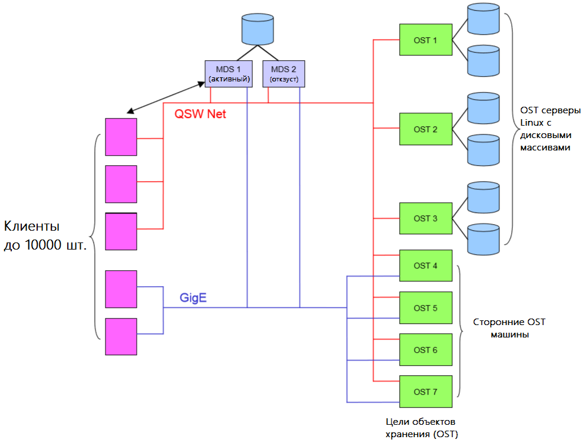
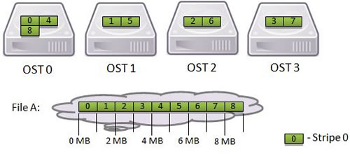

###LustreFS
LustreFS (от "Linux" + "cluster") - современная распределенная файловая система массового параллелизма, используемая в компьютерных кластерах. 

####Архитектура
Архитектура Lustre держится на 3 основных элементах: MDS, OSS и кленте.
 * MDS -  сервер метаданных(metadata server), будучи соединенным с целью метаданных MDT, отвечает за хранение метаданных о пространстве имен файловой системы. MDT может располагаться на одном или нескольких дисковых устройствах. 
 * OSS - сервер хранения объектов(object storage server), отвечает за хранение данных файлов, расположенных в одной или нескольких целях хранения объектов (OST). В свою очередь OST управляет одной локальной дисковой файловой системой. 
 * Клиент - машина, которая монтирует Lustre. После монтирования клиент получает доступ к единому пространству имен файловой системы, обеспечивается полная прозрачность.

Помимо этого для функционирования системы необходим еще один компонент, по большому счету не являющийся ее частью - MGS. Его роль заключается в предоставлении конфигурационной информации всем компонентам одной или нескольким файловым системам Lustre. Он также нуждается в отдельном хранилище данных, но чисто теоретически он может быть и совмещен с одним из компонентов файловой системы.

Программное обеспечение клиента Lustre предоставляет интерфейс между файловое системой Linux и серверами Lustre. Оно включает в себя клиента для MGS - MGC, клиента для MDS - MDC и множество клиентов OST - OSC (сколько OST, столько и OSC).

Logical object volume (LOV) объединяет в себе все OSC, чтобы обеспечить прозрачный доступ ко всем OST. Таким образом, клиет Lustre одно связанное и синхронизированное пространство имен.

####Функциональность 

На уровне файловой системы Lustre трактует файлы как объекты, расположение которых можно определить с помощью MDS. MDS обеспечивает следующие операции с пространствами имен файлов:
 * Поиск файла
 * Создание файла
 * Манипуляции с атрибутами файлов и директорий

MDS сохраняет некий отчет о последних изменениях метаданных, обеспечива тем саимым отказоустойчивость системы.

У каждого регулярного файла, директории, символической ссылки и спецального файла есть уникальный индексный дескриптор (FID). FID регулярного файла содержит ссылки на объекты, которые содержат этот файл. Объекты нfходятся на одном или нескольких OST.

####Разбиение файла на stripe

В Lustre есть возможность распределять сегменты файла, хранящиеся на нескольких OST в stripe. Клиент может указывать число сементов, их размер и OST, на которых они будут храниться. Ниже представлн пример распределления файла между 4 OST.

