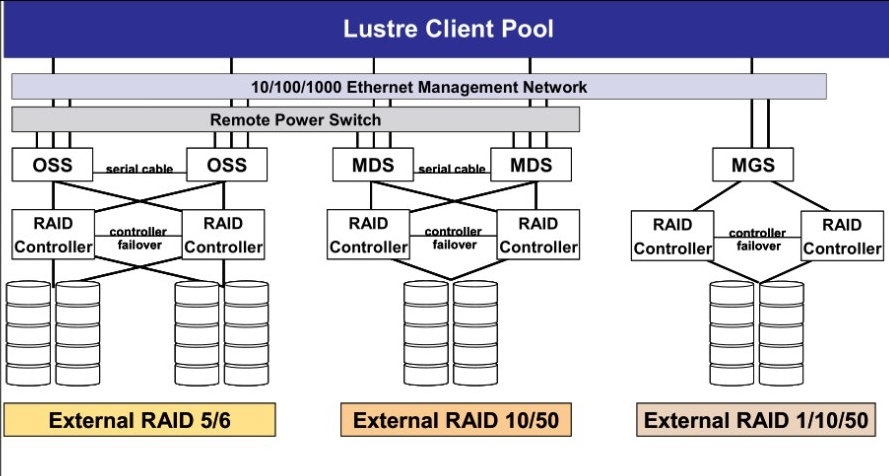

###Разворачивание файловой системы Lustre
#####Основные шаги
1. Определить количество элементов фс, распределить роли.
2. Составить схему распределения, внимательно проверить отказоустойчивость
3. По схеме распределения и характеру данных выбрать параметры Lustre (stripe_size и т.д.)
4. Отформатировать дисковые устройства с параметрами из п.2 и п.3
5. Сконфигурировать LNET
6. Сконфигурировать списки дисковых устройств.

#####Количество элементов, роли, схема распределения
Для оптимальной отказоустойчивости рекомендуется использовать связку из 5 элементов и 6 RAID массивов.


#####Выбор параметров Lustre
######MDS
См. [управление LustreFS](./lustre_managment)

######OST
Разработчики Lustre рекомендуют использовать RAID6 для больших кластеров, так как вероятность потерять сразу два диска крайне высока и при использовании RAID5 это приведет в потере данных.

Для повышения быстродействия рекомендуется использовать в массиве не более 8 дисков (+1 или +2 резервных), так как это число обеспечит большее число IOPS при использовании нескольких независимых RAID.

В идеале, конфигурация RAID должна позволять помещать 1 Мб RPC на stripe без цикла чтения-перезаписи. Таким образом, для рассчета `stripe_width` следует использовать формулу:
> Данная формула работает только для OST!

```
<stripe_width> = <chunksize> * (<disks> - <parity_disks>) <= 1 MB 
```

В случае использования RAID6 или RAID-Z2 `<parity_disks>` будет равен 2. Если конфигурация RAID не позволяет установить `<chunksize>` такой, чтобы `<stripe_width>` был 1 Мб, выбираем размер `<chunksize>` так, чтобы `<stripe_width>` был близок к 1 Мб, но не больше.

При форматировании OST указываем параметр `<stripe_width_blocks> = <stripe_width> / 4096`
```
$ mkfs.lustre --mountfsoptions="stripe=<stripe_width_blocks>" ...
```
